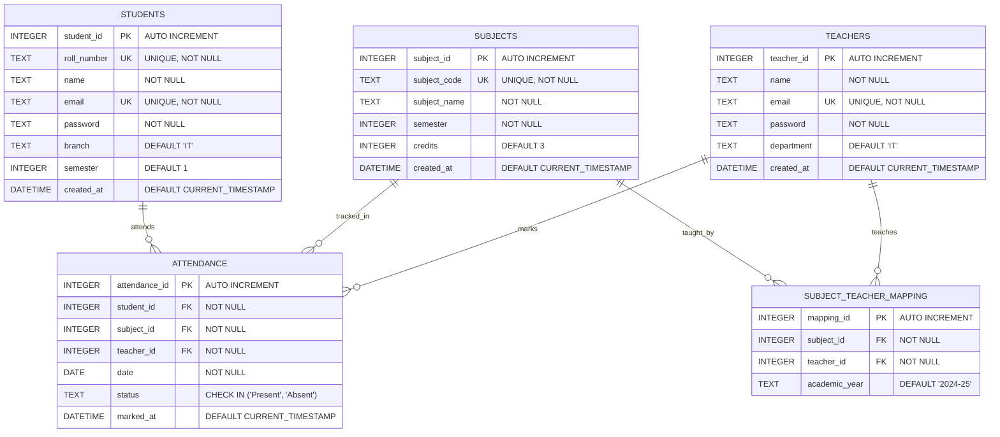

# Entity-Relationship Diagram

## NSUT IT Branch Attendance Portal Database Schema

### Mermaid ER Diagram



## Detailed Entity Descriptions

### 1. STUDENTS Entity
**Purpose**: Stores student information

| Attribute | Type | Constraints | Description |
|-----------|------|-------------|-------------|
| student_id | INTEGER | PRIMARY KEY, AUTOINCREMENT | Unique student identifier |
| roll_number | TEXT | UNIQUE, NOT NULL | Student roll number (e.g., 2021IT001) |
| name | TEXT | NOT NULL | Student full name |
| email | TEXT | UNIQUE, NOT NULL | Student email address |
| password | TEXT | NOT NULL | Student password (plain text for demo) |
| branch | TEXT | DEFAULT 'IT' | Student branch/department |
| semester | INTEGER | DEFAULT 1 | Current semester |
| created_at | DATETIME | DEFAULT CURRENT_TIMESTAMP | Record creation timestamp |

**Sample Data**: 20 students (2021IT001 to 2021IT020)

---

### 2. TEACHERS Entity
**Purpose**: Stores teacher/faculty information

| Attribute | Type | Constraints | Description |
|-----------|------|-------------|-------------|
| teacher_id | INTEGER | PRIMARY KEY, AUTOINCREMENT | Unique teacher identifier |
| name | TEXT | NOT NULL | Teacher full name |
| email | TEXT | UNIQUE, NOT NULL | Teacher email address |
| password | TEXT | NOT NULL | Teacher password (plain text for demo) |
| department | TEXT | DEFAULT 'IT' | Teacher department |
| created_at | DATETIME | DEFAULT CURRENT_TIMESTAMP | Record creation timestamp |

**Sample Data**: 5 teachers (Dr. Rajesh Kumar, Dr. Priya Sharma, etc.)

---

### 3. SUBJECTS Entity
**Purpose**: Stores subject/course information

| Attribute | Type | Constraints | Description |
|-----------|------|-------------|-------------|
| subject_id | INTEGER | PRIMARY KEY, AUTOINCREMENT | Unique subject identifier |
| subject_code | TEXT | UNIQUE, NOT NULL | Subject code (e.g., IT301) |
| subject_name | TEXT | NOT NULL | Subject full name |
| semester | INTEGER | NOT NULL | Semester in which subject is taught |
| credits | INTEGER | DEFAULT 3 | Subject credit hours |
| created_at | DATETIME | DEFAULT CURRENT_TIMESTAMP | Record creation timestamp |

**Sample Data**:
- IT301: Database Management Systems
- IT302: Operating Systems
- IT303: Computer Networks
- IT304: Software Engineering
- IT305: Web Technologies

---

### 4. SUBJECT_TEACHER_MAPPING Entity
**Purpose**: Maps teachers to subjects (Many-to-Many relationship)

| Attribute | Type | Constraints | Description |
|-----------|------|-------------|-------------|
| mapping_id | INTEGER | PRIMARY KEY, AUTOINCREMENT | Unique mapping identifier |
| subject_id | INTEGER | FOREIGN KEY, NOT NULL | Reference to subjects table |
| teacher_id | INTEGER | FOREIGN KEY, NOT NULL | Reference to teachers table |
| academic_year | TEXT | DEFAULT '2024-25' | Academic year for the mapping |

**Constraints**:
- FOREIGN KEY (subject_id) REFERENCES subjects(subject_id) ON DELETE CASCADE
- FOREIGN KEY (teacher_id) REFERENCES teachers(teacher_id) ON DELETE CASCADE
- UNIQUE (subject_id, teacher_id, academic_year)

**Purpose**: Allows one teacher to teach multiple subjects, and one subject to be taught by different teachers in different academic years.

---

### 5. ATTENDANCE Entity
**Purpose**: Stores daily attendance records

| Attribute | Type | Constraints | Description |
|-----------|------|-------------|-------------|
| attendance_id | INTEGER | PRIMARY KEY, AUTOINCREMENT | Unique attendance record identifier |
| student_id | INTEGER | FOREIGN KEY, NOT NULL | Reference to students table |
| subject_id | INTEGER | FOREIGN KEY, NOT NULL | Reference to subjects table |
| teacher_id | INTEGER | FOREIGN KEY, NOT NULL | Reference to teachers table |
| date | DATE | NOT NULL | Date of attendance |
| status | TEXT | CHECK IN ('Present', 'Absent') | Attendance status (SQLite ENUM alternative) |
| marked_at | DATETIME | DEFAULT CURRENT_TIMESTAMP | When attendance was marked |

**Constraints**:
- FOREIGN KEY (student_id) REFERENCES students(student_id) ON DELETE CASCADE
- FOREIGN KEY (subject_id) REFERENCES subjects(subject_id) ON DELETE CASCADE
- FOREIGN KEY (teacher_id) REFERENCES teachers(teacher_id) ON DELETE CASCADE
- UNIQUE (student_id, subject_id, date) - Prevents duplicate attendance for same student/subject/date

---

## Relationships

### 1. Students ↔ Attendance (One-to-Many)
- **Cardinality**: One student can have many attendance records
- **Type**: Identifying relationship
- **Foreign Key**: attendance.student_id → students.student_id
- **Delete Rule**: CASCADE (deleting a student removes all their attendance records)

### 2. Subjects ↔ Attendance (One-to-Many)
- **Cardinality**: One subject can have many attendance records
- **Type**: Identifying relationship
- **Foreign Key**: attendance.subject_id → subjects.subject_id
- **Delete Rule**: CASCADE (deleting a subject removes all attendance records for it)

### 3. Teachers ↔ Attendance (One-to-Many)
- **Cardinality**: One teacher can mark attendance for many records
- **Type**: Identifying relationship
- **Foreign Key**: attendance.teacher_id → teachers.teacher_id
- **Delete Rule**: CASCADE (deleting a teacher removes all attendance they marked)

### 4. Teachers ↔ Subjects (Many-to-Many via SUBJECT_TEACHER_MAPPING)
- **Cardinality**:
  - One teacher can teach multiple subjects
  - One subject can be taught by multiple teachers (different years/sections)
- **Type**: Non-identifying relationship
- **Implementation**: Junction/Bridge table (subject_teacher_mapping)
- **Foreign Keys**:
  - subject_teacher_mapping.subject_id → subjects.subject_id
  - subject_teacher_mapping.teacher_id → teachers.teacher_id
- **Delete Rule**: CASCADE (deleting a teacher or subject removes the mapping)

---

## Cardinality Summary

```
STUDENTS (1) ----< (∞) ATTENDANCE (∞) >---- (1) SUBJECTS
                         ↑
                         |
                        (∞)
                         |
                        (1)
                      TEACHERS
                         |
                        (∞)
                         |
              SUBJECT_TEACHER_MAPPING
                         |
                        (∞)
                         |
                        (1)
                      SUBJECTS
```

---

## Database Design Highlights

### Normalization
- **1NF**: All attributes contain atomic values
- **2NF**: No partial dependencies (all non-key attributes depend on entire primary key)
- **3NF**: No transitive dependencies (no non-key attribute depends on another non-key attribute)

### Referential Integrity
- All foreign keys use `ON DELETE CASCADE`
- Ensures orphaned records are automatically cleaned up
- Maintains data consistency

### Data Integrity Constraints
1. **Primary Keys**: Ensure unique identification of each record
2. **Unique Constraints**: Prevent duplicate emails, roll numbers, subject codes
3. **CHECK Constraints**: Validate attendance status (Present/Absent only)
4. **NOT NULL Constraints**: Ensure required fields are populated
5. **Default Values**: Provide sensible defaults (branch='IT', semester=1)

### Indexing Strategy
- **Automatic Indexes**: Created on all PRIMARY KEY and UNIQUE constraints
- **Foreign Key Indexes**: SQLite automatically indexes foreign key columns
- **Composite Unique Index**: (student_id, subject_id, date) in attendance table

---

## Sample Queries Using This Schema

### 1. Get Student's Attendance for All Subjects
```sql
SELECT
    s.subject_name,
    COUNT(a.attendance_id) AS total_classes,
    SUM(CASE WHEN a.status = 'Present' THEN 1 ELSE 0 END) AS attended
FROM subjects s
LEFT JOIN attendance a ON s.subject_id = a.subject_id
WHERE a.student_id = 1
GROUP BY s.subject_id;
```

### 2. Get Teacher's Assigned Subjects
```sql
SELECT s.subject_code, s.subject_name
FROM subjects s
INNER JOIN subject_teacher_mapping stm ON s.subject_id = stm.subject_id
WHERE stm.teacher_id = 1;
```

### 3. Mark Attendance for a Class
```sql
-- Delete existing (if updating)
DELETE FROM attendance WHERE subject_id = 1 AND date = '2024-11-11';

-- Insert new records
INSERT INTO attendance (student_id, subject_id, teacher_id, date, status)
VALUES (1, 1, 1, '2024-11-11', 'Present');
```

---

## Views

### student_attendance_summary
Pre-computed attendance statistics for efficient querying:

```sql
CREATE VIEW student_attendance_summary AS
SELECT
    s.student_id,
    s.roll_number,
    s.name AS student_name,
    subj.subject_id,
    subj.subject_code,
    subj.subject_name,
    COUNT(a.attendance_id) AS total_classes,
    SUM(CASE WHEN a.status = 'Present' THEN 1 ELSE 0 END) AS classes_attended,
    ROUND((SUM(CASE WHEN a.status = 'Present' THEN 1 ELSE 0 END) * 100.0 / COUNT(a.attendance_id)), 2) AS attendance_percentage
FROM students s
CROSS JOIN subjects subj
LEFT JOIN attendance a ON s.student_id = a.student_id AND subj.subject_id = a.subject_id
GROUP BY s.student_id, subj.subject_id;
```

---

## SQLite-Specific Considerations

1. **AUTOINCREMENT vs AUTO_INCREMENT**: SQLite uses AUTOINCREMENT keyword
2. **Data Types**: SQLite uses dynamic typing with type affinity (TEXT, INTEGER, etc.)
3. **Foreign Keys**: Must be explicitly enabled with `PRAGMA foreign_keys = ON;`
4. **CHECK Constraints**: Used instead of ENUM for status validation
5. **DATETIME**: Stores timestamps as TEXT in ISO 8601 format
6. **Float Division**: Requires explicit decimal (100.0 not 100) for accurate percentage calculations

---

## Entity Count (Sample Data)

| Entity | Records | Description |
|--------|---------|-------------|
| students | 20 | 2021IT001 to 2021IT020 |
| teachers | 5 | One per subject |
| subjects | 5 | IT301 to IT305 |
| subject_teacher_mapping | 5 | One teacher per subject |
| attendance | ~15 | Sample records for demo |

---

**Generated for**: NSUT IT Branch Teacher Attendance Portal
**Database**: SQLite 3
**Last Updated**: November 2024
